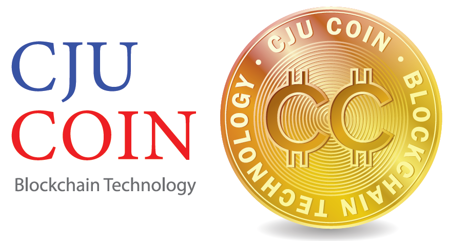

안녕하세요,

블록체인 기반 코인 네트워크 구축 강의 입니다.
강의 동영상, 슬라이드, 소스코드를 제공합니다.

블록체인 기술을 실제로 코딩하고, 코인을 만들어 보는 과정입니다.

- 강의 내용

|순번|내용|동영상|슬라이드|소스코드|
|:---:|---|:---:|:---:|:---:|
|01|오리엔테이션|[click](https://youtu.be/Nqmxvvz9GHk)|[바로가기](./lec_01_orientation/꼰대강의_블록체인_01_Orientation.pdf)|없음|
|02|이론 1. 블록체인 역사, 개념/논문 소개|[click](https://youtu.be/0mS6tG1c14g)|[바로가기](./lec_02_theory/꼰대강의_블록체인_02_Theroy.pdf)|없음|
|03|이론 2. 핵심기술, 해시, 머클 트리|[click](https://youtu.be/tHRF8cRE05w)|[바로가기](./lec_02_theory/꼰대강의_블록체인_02_Theroy.pdf)|없음
|04|03-01. 개발환경 세팅|[click](https://youtu.be/Ucao3tWKgTQ)|[바로가기](./lec_03_blockchain_class/lecture_slides/꼰대강의_블록체인_03_01_개발환경%20세팅.pdf)|[이동](https://github.com/kafa46/cju_coin/tree/master/lec_03_blockchain_class)|
|05|03-02. 플라스크 설정 및 데이터베이스 설정|[click]()|[바로가기](./lec_03_blockchain_class/lecture_slides/꼰대강의_블록체인_03_02_플라스크%20설정%20및%20데이터베이스%20생성.pdf)|[이동](https://github.com/kafa46/cju_coin/tree/master/lec_03_blockchain_class)|
|06|03-03. Blockchain 클래스 구현 및 작동|[click]()|[바로가기](./lec_03_blockchain_class/lecture_slides/꼰대강의_블록체인_03_03_blockchain%20구현%20및%20작동.pdf)|[이동](https://github.com/kafa46/cju_coin/tree/master/lec_03_blockchain_class)|
